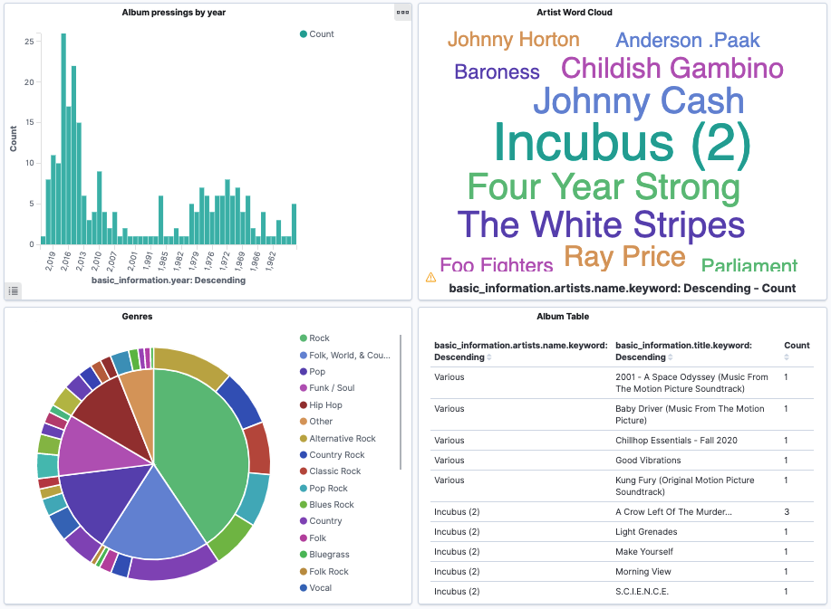

# Discogs

A collection of scripts used to interact with ta public [Discogs](https://www.discogs.com/) library. Discogs API documentation can be found [here](https://www.discogs.com/developers).

---
## Setup
1. Create and activate a new virtual environment
2. Run `pip install -r requirements.txt` to install necessary packages
3. To authenticate to your Elasticsearch instance, you will need to rename the file `.env-EDIT_ME` to `.env` and update the listed variables.

---

## discogs_es_sync.py
Pass a Discogs username to through this script to import the user's public Discogs library into an Elasticsearch cluster. If you are primarily using this script for a single discogs user, you can update the `discogs_username` variable in the `.env` file. Otherwise, be sure to supply a username via the `-u` or `--user` argument in the cli when running the script. Logic has been added for this script to add/remove items from your Discogs collection that do not exist within Elasticsearch (or vice versa if you sell a record). Run this script on a cron tab to regularly keep your Elasticsearch index in sync with your Discogs collection.

Optional Arguments | Description
------------ | -------------
-u, --users| Provide an alternate Discogs username.

Once imported, you can configure a Kibana Dashboard to visualize trends amongst your music collection.

---

### gimme5.py
Not sure what you want to spin next? Run this script to return five randomly selected entries from the supplied Discogs user's public library.

Just as with `discogs_es_sync.py`, the default username will be pulled from the .env file. Otherwise, you can use the `-u` or `--user` argument to specify an alternate user from the cli.

Optional Arguments | Description
------------ | -------------
-u, --users| Provide an alternate Discogs username.
-r, --records, -c, --count | Provide an integer to specify the number of records to return.
